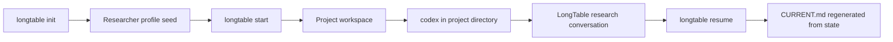
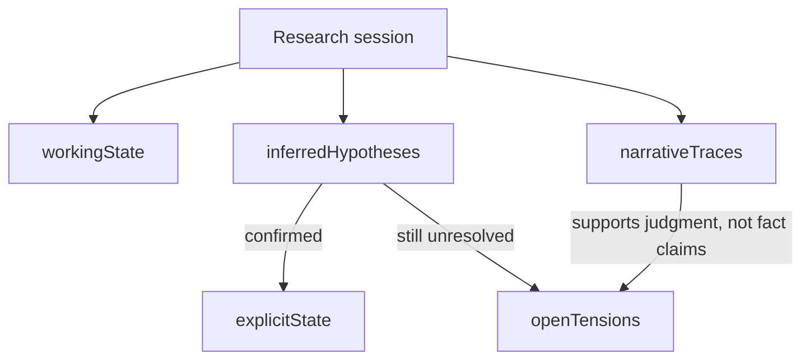

# LongTable

LongTable is a researcher-centered harness.

It is not meant to replace the researcher. It is meant to help the researcher ask better questions, keep uncertainty visible, preserve authorship, and maintain a durable project workspace across sessions.

This repository is the refactoring workspace and current source of truth for the next LongTable product contract.

## Core Flow



## Product Contract

LongTable is intentionally workspace-first.

- `longtable init` is the one-time global setup.
- `longtable start` creates a project workspace and memory seed.
- The real research conversation begins after opening `codex` inside that workspace.

The goal is to make the first minute clear for both novice researchers and power users.

## Start Contract

After `longtable start`, the root should stay minimal.

| Artifact | Role | Canonical? |
| --- | --- | --- |
| `AGENTS.md` | Runtime guidance for Codex | No |
| `CURRENT.md` | Human-facing current view | No, generated |
| `.longtable/project.json` | Stable project identity | Yes |
| `.longtable/current-session.json` | Current session cursor | Yes |
| `.longtable/state.json` | Layered memory state | Yes |
| `.longtable/sessions/` | Historical session snapshots | Yes |

The old root artifact set is being retired:

- `LONGTABLE.md`
- `START-HERE.md`
- `NEXT-STEPS.md`
- `SESSION-SNAPSHOT.md`

## Memory Model

LongTable separates memory into layers instead of flattening everything into one prompt.

- `explicitState`: confirmed facts and approved decisions
- `workingState`: current goal, blocker, next action, open questions
- `inferredHypotheses`: useful interpretations that still require confirmation
- `openTensions`: unresolved tradeoffs that should stay visible
- `narrativeTraces`: authorship and judgment traces that should not be flattened away

This is the core defense against false certainty around tacit knowledge.



## Example Workspace

```text
My-Project/
  AGENTS.md
  CURRENT.md
  .longtable/
    project.json
    current-session.json
    state.json
    sessions/
      project-name-1710000000000.json
```

## Quickstart

```bash
npm install -g @longtable/cli
longtable init --flow interview
longtable start
cd "<project-path>"
codex
```

When you return later:

```bash
cd "<project-path>"
longtable resume
codex
```

## Inside Codex

Most sessions should continue in natural language.

If you want an explicit invocation, use short text forms:

- `lt explore: <question>`
- `lt review: <claim or plan>`
- `lt panel: <object with disagreement>`
- `lt editor: <draft or positioning question>`
- `lt methods: <design or analysis plan>`

## Why This Shape

The current contract optimizes for:

1. successful first entry
2. minimal root artifacts
3. human-readable continuity
4. strict machine-readable state
5. visible disagreement when needed

The system should feel simple at the root and structured under `.longtable/`.

## Local Validation

```bash
npm install
npm run typecheck
npm run build
```

## Packages

- `@longtable/cli`
- `@longtable/core`
- `@longtable/memory`
- `@longtable/checkpoints`
- `@longtable/setup`
- `@longtable/provider-codex`
- `@longtable/provider-claude`

## Key Docs

- [Spec](Spec.md)
- [Architecture](docs/ARCHITECTURE.md)
- [Memory](docs/MEMORY.md)
- [Checkpointing](docs/CHECKPOINTING.md)
- [Evidence Policy](docs/EVIDENCE-POLICY.md)
- [Question Runtime](docs/QUESTION-RUNTIME.md)
- [LongTable Command Surface](docs/LONGTABLE-COMMAND-SURFACE.md)
- [Active Decisions](docs/ACTIVE-DECISIONS.md)
