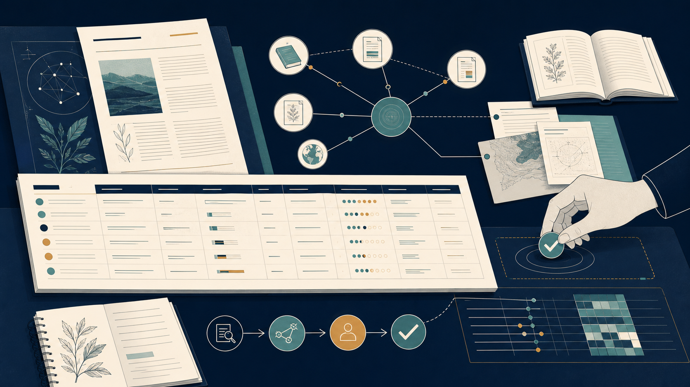

# LongTable

Research diagnosis and journal-grounded evidence production for Codex and Claude.



LongTable gives researchers two public skills:

- `$longtable` diagnoses the research problem, asks no more than three clarifying questions, and produces a versioned Research Brief.
- `$longtable-research` turns that brief into a lawful, traceable, human-verified research package.

The model provider supplies native agents and tools. LongTable supplies the research-specific contract they do not: durable state, access boundaries, evidence provenance, target-journal patterns, claim gates, editable visual contracts, human checkpoints, and reproducible package verification.

> `0.2.0-beta.1` is published on npm under the `next` tag. The former `scholar-research`, `panel`, and expanded skill surfaces remain compatibility routes for one beta release; they are not the product’s primary interface.

## Install

```sh
npm install -g @longtable/cli@next
longtable setup
```

`longtable setup` installs exactly two provider skills. It removes obsolete LongTable start, interview, panel, and per-role skill folders from the selected Codex or Claude skill directory.

Start in Codex or Claude:

```text
$longtable Help me sharpen this research problem and decide what evidence I need.
```

When the Research Brief is ready, choose:

```text
Start LongTable Research
Keep shaping
Save and stop
```

The execution skill consumes the existing brief without repeating the interview:

```text
$longtable-research Explore the target journal, collect the lawful corpus,
build the evidence ledger, and produce the verified tables and figures.
```

## What “verified” means

A run cannot report `completed` until it creates and reads back a Verified Research Package containing:

- Research Brief in versioned JSON and human-readable Markdown
- target-journal topic and format profile with provenance and human acceptance
- search and full-text corpus manifests
- bounded extraction, evidence spans, claim ledger, synthesis, and disagreement records
- human-reviewed editable tables, figures, and diagrams with data and hashes
- Research Assurance records at the five material boundaries
- limitations, reproduction command, machine manifest, human README, and passing verification report

```sh
longtable research verify --cwd "<project>" --run-id "<run-id>" --json
```

Local edits, provider output, a reachable URL, and a polished figure are not treated as proof of completion.

## Research Assurance

Research Assurance is the successor to the old Panel concept. Codex and Claude already know how to call multiple agents; LongTable does not compete with that orchestration.

Instead, Assurance selects research-risk lenses, normalizes evidence and disagreement, and records the human decision at five boundaries:

1. scope
2. access and corpus
3. evidence direction or claim strength
4. visual evidence
5. external action

It interrupts only on a hard failure or unresolved material conflict. The canonical diagnostic CLI is `longtable assure`; `longtable panel` is a one-release compatibility alias. Existing v1 `PanelPlan` and `PanelResult` records remain readable.

## Lawful full-text access

LongTable supports four declared routes:

- public OA and repositories
- PDFs lawfully supplied by the researcher
- explicitly licensed text-and-data-mining access
- manual institutional-browser handoff

The manual route asks the researcher to download a lawful copy and provide a local directory. LongTable never requests or stores browser cookies, passwords, tokens, or institutional credentials. Paywall, WAF, robots, VPN, proxy, and login-control bypass are prohibited. Access failures remain typed outcomes such as `restricted_access`, `robots_or_terms_blocked`, `manual_handoff_required`, and `parse_failed`.

## Professional figures and tables

Research visuals are evidence artifacts, not image-generation prompts.

- A table is used for exact lookup, auditability, and dense comparison.
- A figure is used for patterns, distributions, uncertainty, and comparisons.
- A diagram is used for mechanisms, workflow, architecture, or performed-versus-proposed boundaries.
- Every visual begins with an analytical question, claim link, denominator or unit of analysis, evidence boundary, target-journal grammar, and reader test.
- Research visuals must have deterministic, editable sources and data/provenance hashes.
- Mechanical QA is followed by human domain, statistical, journal-fit, and comprehension review.

Image generation may be used for clearly labeled brand or concept artwork such as the README banner above. It must not fabricate evidence-bearing research figures or tables.

## CLI automation

The normal path is conversational, but every durable boundary is scriptable:

```sh
# Start from a question; LongTable writes a Research Brief automatically.
longtable research run \
  --query "How is AI adoption validated in workplace learning research?" \
  --target-journal "Human Resource Development Quarterly" \
  --cwd .

# Or consume a Research Brief created by $longtable.
longtable research run --brief research-brief.json --cwd .

# Resume after a lawful manual PDF handoff.
longtable research resume \
  --pdf-dir ./lawful-pdfs \
  --pdf-access manual_legitimate_access \
  --cwd .

# Record the human-reviewed target-journal evidence profile.
longtable research record-journal-profile \
  --profile target-journal-profile.json \
  --cwd .

longtable research status --cwd . --json
longtable research verify --cwd . --json
```

The previous `longtable scholar-research` command remains a deprecated alias for the beta compatibility window.

## Productivity gate

More workflow is not automatically better. A stage remains default only when prospective conversational crossover tests show that it helps researchers.

Promotion beyond beta requires at least three complete matched E2E pairs, zero hard-gate failures, non-worse time to an accepted package, and improvement in at least one human burden or trust measure. Repetitive questions, interruptions, context switching, rework, and abandonment are measured. Stages that add friction without marginal value are removed or made opt-in.

## Packages

- `@longtable/cli` — setup, diagnostics, state, Assurance, and research CLI
- `@longtable/research` — canonical journal-to-artifact runtime
- `@longtable/core`, `@longtable/memory`, `@longtable/checkpoints` — provider-neutral contracts
- `@longtable/provider-codex`, `@longtable/provider-claude` — two-skill provider adapters
- `@longtable/scholar-research` — one-release compatibility wrapper

See [the runtime contract](docs/LONGTABLE-RESEARCH-RUNTIME.md), [the command surface](docs/LONGTABLE-COMMAND-SURFACE.md), and [the specification](Spec.md).

## Development

```sh
npm install
npm run build
npm test
npm run release:check
```

LongTable records research state under `.longtable/`. Historical run directories and v1 record schemas are preserved; the 0.2 beta adds canonical names and stronger completion gates without rewriting prior evidence.
