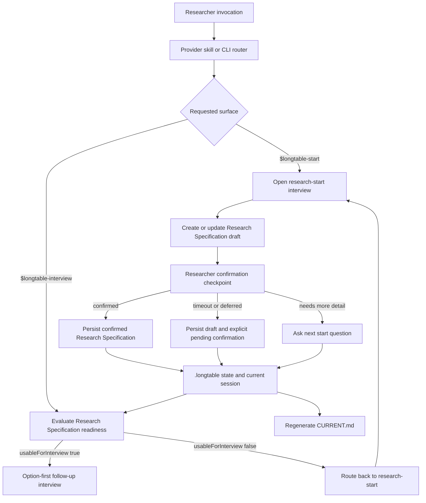
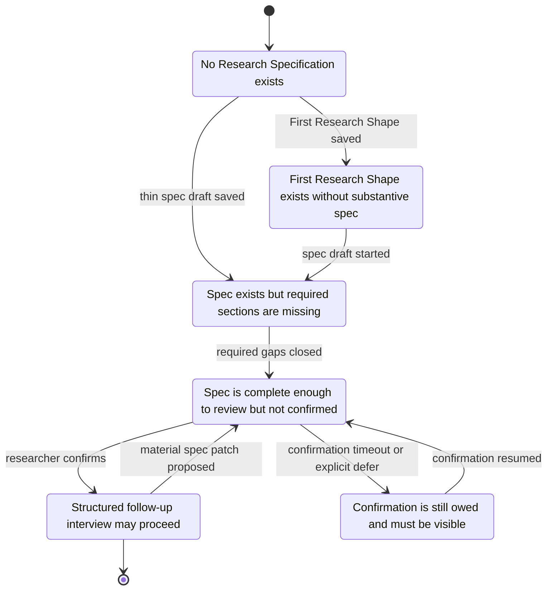
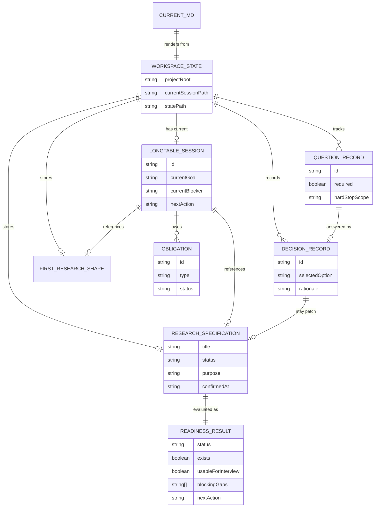
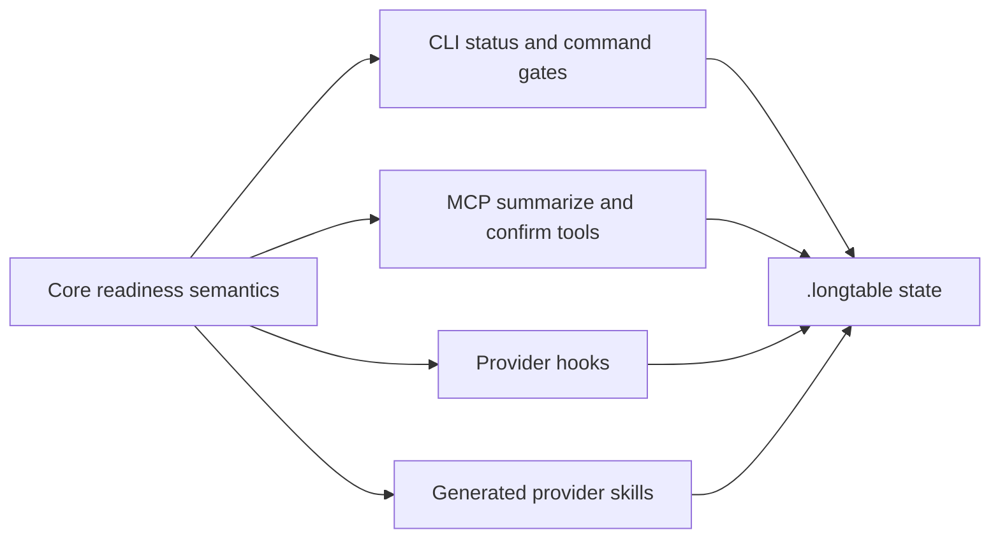

# Research Specification Readiness Architecture

## Purpose

This document is the maintainable diagram source for the `$longtable-start` to
`$longtable-interview` handoff.

It exists because the product contract is simple but easy to scatter:

- `$longtable-start` creates or continues a Research Specification.
- `$longtable-interview` is post-start and option-first only after a usable
  Research Specification exists.
- First Research Shape is a handle and resume layer, not a substitute for the
  Research Specification.

The diagrams below are source diagrams, not exported illustrations. If a PNG or
slide image is needed, generate it from this Markdown/Mermaid source and do not
treat the exported image as canonical.

## Decision

LongTable should keep one shared Research Specification readiness gate. Provider
skills, MCP tools, CLI status, hooks, and docs should all use the same readiness
meaning.

The gate answers one question:

> Can this workspace safely move from research-start into structured follow-up
> interview?

The answer is not provider-specific. Codex, Claude, MCP, terminal prompts, and
future UI surfaces may present the result differently, but they must not define
different readiness semantics.

## Pipeline



## Readiness States



`confirmed` is the normal unlock state for `$longtable-interview`.
`draft_pending_confirmation` and `deferred` are not silent failures. They are
valid saved states, but the next action must say that confirmation is pending.

## Entity Map



## Shared Gate Contract

The shared readiness gate should return a small structured result:

```ts
type ResearchSpecificationReadiness = {
  exists: boolean;
  status:
    | "no_spec"
    | "shape_only"
    | "structurally_incomplete"
    | "draft_pending_confirmation"
    | "deferred"
    | "confirmed";
  structuralStatus: "missing" | "incomplete" | "complete";
  confirmationStatus: "not_applicable" | "pending" | "deferred" | "confirmed";
  usableForInterview: boolean;
  blockingGaps: string[];
  nextAction: "start" | "confirm_spec" | "resume_confirmation" | "interview";
};
```

Minimum gate meaning:

- No Research Specification means `$longtable-interview` routes to
  `$longtable-start`.
- First Research Shape without a Research Specification is still incomplete.
- A structurally thin specification must keep asking start questions.
- A complete draft without confirmation is saved, but it must surface a pending
  confirmation next action.
- Only a confirmed Research Specification unlocks normal option-first interview.

## Orchestration Boundary



Core owns readiness semantics. Adapters own presentation. State remains the
source of truth.

## Maintenance Rule

Update this document when any change affects:

- what counts as a usable Research Specification
- the `$longtable-start` terminal states
- the `$longtable-interview` precondition
- confirmation timeout or deferral behavior
- the state fields used by the readiness gate

Every such change should also add or update a smoke test that proves the gate
and at least one user-facing route agree.
