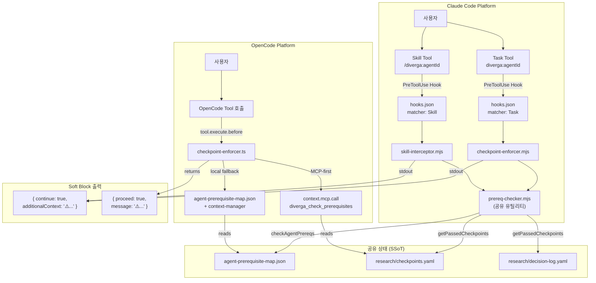
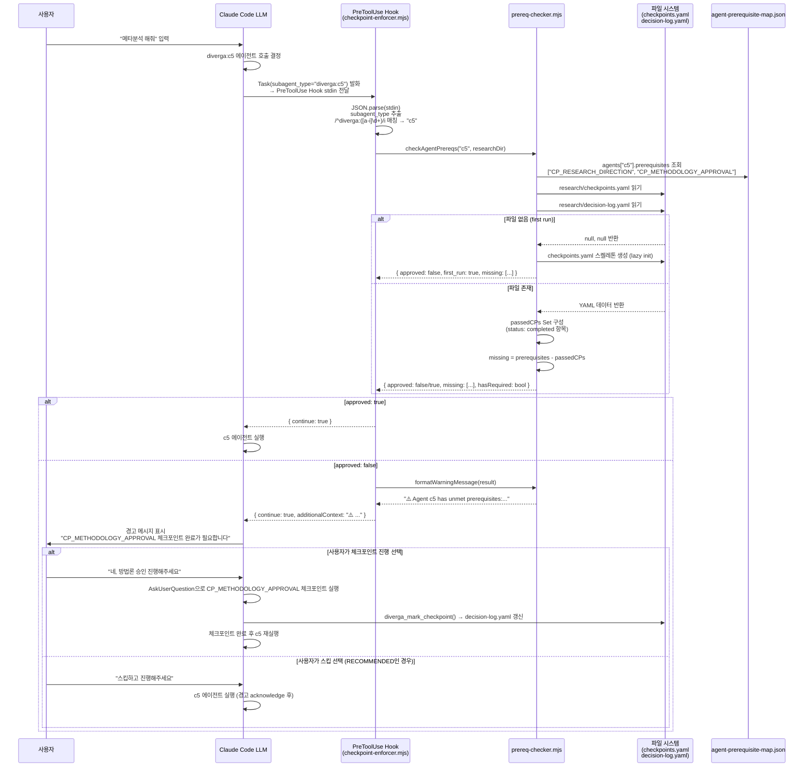
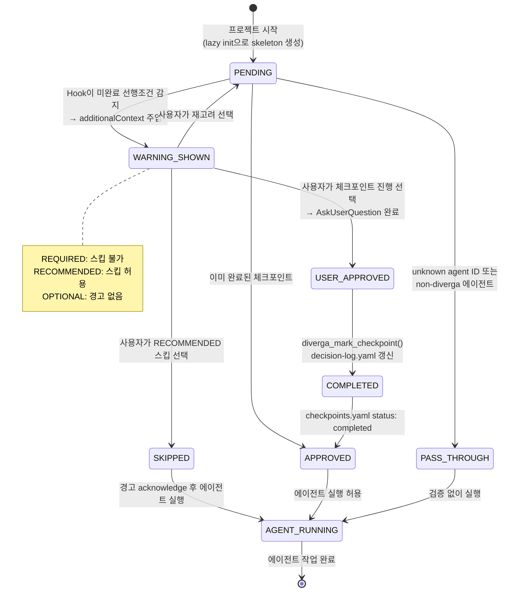

# SDD: Hook-Based Checkpoint Enforcement v10.3.1

**문서 유형**: System Design Document (SDD)
**버전**: 10.3.1
**작성일**: 2026-02-28
**상태**: Active

---

## 목차

1. [개요 (Overview)](#1-개요-overview)
2. [아키텍처 (Architecture)](#2-아키텍처-architecture)
3. [컴포넌트 상세 (Component Details)](#3-컴포넌트-상세-component-details)
4. [데이터 흐름 (Data Flow)](#4-데이터-흐름-data-flow)
5. [소프트 블록 전략 (Soft Block Strategy)](#5-소프트-블록-전략-soft-block-strategy)
6. [Cross-Platform 일관성 (Cross-Platform Consistency)](#6-cross-platform-일관성-cross-platform-consistency)
7. [에러 처리 (Error Handling)](#7-에러-처리-error-handling)
8. [제약사항 및 트레이드오프 (Constraints & Trade-offs)](#8-제약사항-및-트레이드오프-constraints--trade-offs)
9. [파일 구조 (File Structure)](#9-파일-구조-file-structure)
10. [테스트 전략 (Test Strategy)](#10-테스트-전략-test-strategy)

---

## 1. 개요 (Overview)

### 1.1 문제 정의

Diverga의 체크포인트 시스템은 연구 워크플로우 전반에 걸쳐 인간 의사결정을 보장하는 핵심 메커니즘이다. v8.2.0에서 MCP 런타임 체크포인트 강제 시스템이 도입되었으나, 다음과 같은 우회 경로가 존재했다:

**핵심 문제**: 에이전트를 직접 호출할 때 (`Task(subagent_type="diverga:c5", ...)`) coordinator를 통하지 않으면 체크포인트 검증이 활성화되지 않는다.

구체적인 시나리오:

```
[문제 시나리오 — 우회 발생]
사용자 → "메타분석 해줘" → diverga:c5 직접 호출
         │
         ↓
  coordinator 미경유
         │
         ↓
  CP_METHODOLOGY_APPROVAL 미검증 (c5의 필수 선행 체크포인트)
         │
         ↓
  에이전트 실행 → 연구 방법론 승인 없이 분석 진행
```

이는 CLAUDE.md의 "Rule 2: 전제조건 Gate (스킵 불가)" 및 "Rule 6: MCP-First Verification" 규칙을 위반하는 상황이다.

Claude Code의 shell hook은 `AskUserQuestion` 도구를 직접 호출할 수 없다는 플랫폼 제약도 함께 존재한다.

### 1.2 해결 방안

**플랫폼 레벨 PreToolUse hook**을 통한 소프트 블록(soft block) 강제 메커니즘을 도입한다.

핵심 설계 원칙:

| 원칙 | 내용 |
|------|------|
| **Defense-in-Depth** | CLAUDE.md 프롬프트 강제 + Hook 런타임 강제의 이중 레이어 |
| **항상 계속 진행 (continue: true)** | Shell hook은 AskUserQuestion 불가 → LLM에 경고 주입으로 위임 |
| **SSoT (Single Source of Truth)** | `agent-prerequisite-map.json`이 모든 플랫폼에서 동일하게 참조 |
| **Cross-Platform** | Claude Code + OpenCode 양쪽에서 동일한 상태 파일(YAML) 공유 |
| **Graceful Fallback** | MCP 미가용 시 로컬 파일 직접 읽기로 대체 |

### 1.3 버전 히스토리

| 버전 | 변경사항 |
|------|---------|
| v8.1.0 | Agent Prerequisite Map 도입, CLAUDE.md 프롬프트 레벨 강제 |
| v8.2.0 | MCP 런타임 체크포인트 강제 (`diverga_check_prerequisites` 도구) |
| v10.3.1 | **Hook-Based Checkpoint Enforcement** — PreToolUse hook으로 플랫폼 레벨 소프트 블록 추가 |

---

## 2. 아키텍처 (Architecture)

### 2.1 전체 아키텍처 다이어그램

```
┌─────────────────────────────────────────────────────────────────────┐
│                     CLAUDE CODE 플랫폼                              │
│                                                                     │
│  사용자 입력                                                         │
│      │                                                              │
│      ▼                                                              │
│  ┌─────────────────────────────────┐                               │
│  │   Task Tool (diverga:c5)  OR    │                               │
│  │   Skill Tool (/diverga:c1)      │                               │
│  └─────────────┬───────────────────┘                               │
│                │ PreToolUse Hook 발화                               │
│                ▼                                                    │
│  ┌─────────────────────────────────────────────────────────┐       │
│  │              hooks/hooks.json (hook 설정)                │       │
│  │   matcher: "Task"  →  checkpoint-enforcer.mjs           │       │
│  │   matcher: "Skill" →  skill-interceptor.mjs             │       │
│  └──────────────────┬──────────────────────────────────────┘       │
│                     │ stdin (JSON: tool_input)                      │
│                     ▼                                               │
│  ┌──────────────────────────────────────────────────────────┐      │
│  │         mcp/lib/prereq-checker.mjs (공유 유틸리티)        │      │
│  │   checkAgentPrereqs(agentId, researchDir)                │      │
│  │   formatWarningMessage(result)                           │      │
│  └──────────────┬───────────────────────────────────────────┘      │
│                 │                                                   │
│         ┌───────┴──────────┐                                       │
│         │                  │                                       │
│         ▼                  ▼                                       │
│  ┌─────────────┐  ┌──────────────────────┐                        │
│  │  MCP 도구    │  │   로컬 파일 직접 읽기  │                        │
│  │  (diverga_  │  │  research/checkpoints │                        │
│  │  check_     │  │  .yaml               │                        │
│  │  prereqs)   │  │  research/decision-  │                        │
│  └──────┬──────┘  │  log.yaml            │                        │
│         │         └──────────┬───────────┘                        │
│         └─────────┬──────────┘                                     │
│                   │                                                 │
│                   ▼                                                 │
│  ┌─────────────────────────────────────────────────────────┐       │
│  │              Soft Block Response (stdout)                │       │
│  │   { continue: true, additionalContext: "⚠️ ..." }       │       │
│  └─────────────────────────────────────────────────────────┘       │
│                   │                                                 │
│                   ▼                                                 │
│            LLM이 경고 인식 후 사용자에게 전달                         │
│                                                                     │
└─────────────────────────────────────────────────────────────────────┘

┌─────────────────────────────────────────────────────────────────────┐
│                     OPENCODE 플랫폼                                  │
│                                                                     │
│  사용자 입력                                                         │
│      │                                                              │
│      ▼                                                              │
│  ┌─────────────────────────────────┐                               │
│  │   tool.execute.before Hook 발화  │                               │
│  └─────────────┬───────────────────┘                               │
│                │                                                    │
│                ▼                                                    │
│  ┌──────────────────────────────────────────────────────────┐      │
│  │   .opencode/plugins/diverga/hooks/checkpoint-enforcer.ts │      │
│  └──────────────┬─────────────────────────────────────────--┘      │
│                 │                                                   │
│         ┌───────┴──────────┐                                       │
│         │ MCP-First         │ Local Fallback                       │
│         ▼                  ▼                                       │
│  ┌─────────────┐  ┌──────────────────────────────────────┐        │
│  │  context.   │  │  agent-prerequisite-map.json (SSoT)   │        │
│  │  mcp.call   │  │  context-manager (loadContext())      │        │
│  │  (diverga_  │  │  completedCheckpoints 배열 확인        │        │
│  │  check_     │  └──────────────────────────────────────┘        │
│  │  prereqs)   │                                                   │
│  └─────────────┘                                                   │
│                   │                                                 │
│                   ▼                                                 │
│  ┌─────────────────────────────────────────────────────────┐       │
│  │              Soft Block Response                         │       │
│  │   { proceed: true, message: "⚠️ ...", checkpoint: ... } │       │
│  └─────────────────────────────────────────────────────────┘       │
│                                                                     │
└─────────────────────────────────────────────────────────────────────┘
```

### 2.2 공유 컴포넌트 다이어그램

```
┌─────────────────────────────────────────────────────────────────────┐
│                    공유 상태 및 SSoT 레이어                           │
│                                                                     │
│  ┌─────────────────────────────────────────────────────────────┐   │
│  │              mcp/agent-prerequisite-map.json                 │   │
│  │                     (SSoT — Single Source of Truth)         │   │
│  │                                                              │   │
│  │  {                                                          │   │
│  │    "agents": {                                              │   │
│  │      "c5": { "prerequisites": ["CP_RESEARCH_DIRECTION",    │   │
│  │                                "CP_METHODOLOGY_APPROVAL"],  │   │
│  │              "own_checkpoints": [...] }                     │   │
│  │    },                                                       │   │
│  │    "checkpoint_levels": {                                   │   │
│  │      "CP_RESEARCH_DIRECTION": "required",                   │   │
│  │      "CP_METHODOLOGY_APPROVAL": "required",                 │   │
│  │      "CP_ANALYSIS_PLAN": "recommended"                      │   │
│  │    }                                                        │   │
│  │  }                                                          │   │
│  └──────────────────────┬──────────────────────────────────────┘   │
│                         │ 양쪽 플랫폼에서 동일하게 참조               │
│              ┌──────────┴───────────┐                              │
│              ▼                      ▼                              │
│  ┌──────────────────┐   ┌──────────────────────────────────────┐   │
│  │prereq-checker.mjs│   │checkpoint-enforcer.ts               │   │
│  │(Claude Code Hook)│   │(OpenCode Hook)                      │   │
│  └──────────────────┘   └──────────────────────────────────────┘   │
│                                                                     │
│  ┌─────────────────────────────────────────────────────────────┐   │
│  │                   공유 상태 파일                              │   │
│  │  research/checkpoints.yaml    ← checkpoint 완료 상태         │   │
│  │  research/decision-log.yaml   ← 사용자 결정 이력             │   │
│  └─────────────────────────────────────────────────────────────┘   │
│                                                                     │
└─────────────────────────────────────────────────────────────────────┘
```

### 2.3 Mermaid 아키텍처 다이어그램



---

## 3. 컴포넌트 상세 (Component Details)

### 3.1 Claude Code Hook System

#### 3.1.1 hooks.json 설정

**파일 경로**: `/Users/hosung/.claude/plugins/diverga/hooks/hooks.json`

```json
{
  "hooks": {
    "PreToolUse": [
      {
        "matcher": "Task",
        "hooks": [
          {
            "type": "command",
            "command": "node /Users/hosung/.claude/plugins/diverga/hooks/checkpoint-enforcer.mjs",
            "timeout": 5
          }
        ]
      },
      {
        "matcher": "Skill",
        "hooks": [
          {
            "type": "command",
            "command": "node /Users/hosung/.claude/plugins/diverga/hooks/skill-interceptor.mjs",
            "timeout": 5
          }
        ]
      }
    ]
  }
}
```

**설계 결정**:
- `PreToolUse` 이벤트: 도구 실행 직전에 발화되어 경고 주입 가능
- `matcher: "Task"`: `diverga:*` 에이전트를 포함한 모든 Task 호출 인터셉트
- `matcher: "Skill"`: `/diverga:*` 스킬 호출 인터셉트
- `timeout: 5`초: hook이 응답하지 않으면 자동 pass-through (연구 흐름 차단 방지)
- `plugin.json`의 `"hooks": "./hooks/hooks.json"`을 통해 플러그인에 등록됨

#### 3.1.2 checkpoint-enforcer.mjs

**파일 경로**: `/Users/hosung/.claude/plugins/diverga/hooks/checkpoint-enforcer.mjs`

**처리 흐름**:

```
stdin (JSON)
    │
    ▼
JSON.parse(input)
    │
    ▼
tool_input.subagent_type 추출
    │
    ▼
/^diverga:([a-i]\d+)/i 정규식 매칭
    │
    ├── 매칭 실패 → { continue: true }  // Non-Diverga 에이전트 pass-through
    │
    └── 매칭 성공 → agentId 정규화 (소문자)
                        │
                        ▼
                 findResearchDir()
                 (cwd에서 상위로 최대 10단계 탐색)
                 research/ 또는 .research/ 디렉토리 찾기
                        │
                        ▼
                 checkAgentPrereqs(agentId, researchDir)
                        │
                        ├── approved: true → { continue: true }
                        │
                        └── approved: false
                                │
                                ▼
                         formatWarningMessage(result)
                                │
                                ▼
                    { continue: true, additionalContext: message }
                                │
                                ▼
                           stdout (JSON)
```

**핵심 코드 패턴**:

```javascript
// 에러 시 항상 pass-through (연구 흐름 방해 방지)
process.stdin.on('end', () => {
  try {
    const hookData = JSON.parse(input);
    const result = processHook(hookData);
    process.stdout.write(JSON.stringify(result));
  } catch (e) {
    process.stdout.write(JSON.stringify({ continue: true }));
  }
});

// Diverga 에이전트 식별: "diverga:c5" → "c5"
const match = subagentType.match(/^diverga:([a-i]\d+)/i);
if (!match) return { continue: true };
```

#### 3.1.3 skill-interceptor.mjs

**파일 경로**: `/Users/hosung/.claude/plugins/diverga/hooks/skill-interceptor.mjs`

`checkpoint-enforcer.mjs`와 동일한 패턴이지만, `tool_input.subagent_type` 대신 `tool_input.skill`에서 에이전트 ID를 추출한다:

```javascript
// Skill 호출: "/diverga:c1" → "c1"
const match = skillName.match(/^diverga:([a-i]\d+)/i);
```

**두 인터셉터의 비교**:

| 속성 | checkpoint-enforcer.mjs | skill-interceptor.mjs |
|------|------------------------|----------------------|
| Hook 대상 | Task Tool | Skill Tool |
| 입력 필드 | `tool_input.subagent_type` | `tool_input.skill` |
| 패턴 | `diverga:agentId` | `diverga:agentId` |
| 공유 의존성 | `prereq-checker.mjs` | `prereq-checker.mjs` |
| 출력 형식 | `{ continue, additionalContext }` | `{ continue, additionalContext }` |

### 3.2 공유 필수조건 검사기 (prereq-checker.mjs)

**파일 경로**: `/Users/hosung/.claude/plugins/diverga/mcp/lib/prereq-checker.mjs`

이 모듈은 양쪽 hook이 공유하는 핵심 유틸리티로, 체크포인트 강제의 비즈니스 로직을 담당한다.

#### 3.2.1 SSoT: agent-prerequisite-map.json

```
mcp/agent-prerequisite-map.json
├── agents                        // 에이전트별 선행 조건 정의
│   ├── a1: { prerequisites: [], own_checkpoints: [...], entry_point: true }
│   ├── a2: { prerequisites: ["CP_RESEARCH_DIRECTION"], own_checkpoints: [...] }
│   ├── c5: { prerequisites: ["CP_RESEARCH_DIRECTION", "CP_METHODOLOGY_APPROVAL"], ... }
│   └── ...
└── checkpoint_levels              // 체크포인트별 중요도 분류
    ├── CP_RESEARCH_DIRECTION: "required"
    ├── CP_METHODOLOGY_APPROVAL: "required"
    ├── CP_ANALYSIS_PLAN: "recommended"
    └── CP_VISUALIZATION_PREFERENCE: "optional"
```

지연 로딩(lazy loading)으로 첫 번째 호출 시에만 파일을 읽어 캐싱한다:

```javascript
let _prereqMap = null;
function getPrereqMap() {
  if (!_prereqMap) {
    _prereqMap = JSON.parse(readFileSync(PREREQ_MAP_PATH, 'utf8'));
  }
  return _prereqMap;
}
```

#### 3.2.2 checkAgentPrereqs() 알고리즘

```
입력: agentId (string), researchDir (string)

1. ID 정규화
   agentId → 소문자 변환 → [-_] 제거 → /^[a-i]\d+/ 추출
   예: "C5" → "c5", "diverga-c5" → "c5"

2. agent-prerequisite-map.json에서 에이전트 정의 조회
   - 미존재: { approved: true } 반환 (알 수 없는 에이전트 pass-through)
   - prerequisites 없음: { approved: true } 반환 (진입점 에이전트)

3. getPassedCheckpoints(researchDir) 호출
   - research/checkpoints.yaml 읽기 (status: "completed" 체크포인트 수집)
   - .research/checkpoints.yaml 읽기 (레거시 경로)
   - research/decision-log.yaml 읽기 (checkpoint_id 보유 항목 수집)
   - .research/decision-log.yaml 읽기 (레거시 경로)
   → Set<string> 반환 (완료된 checkpoint_id 집합)

4. missing = agent.prerequisites.filter(cp => !passedCPs.has(cp))

5. 각 missing CP에 대해 수준 분류:
   - checkpoint_levels[cp] === "required" → 🔴 REQUIRED 경고
   - checkpoint_levels[cp] === "recommended" → 🟠 RECOMMENDED 경고
   - "optional" → 경고 없음

6. 반환값:
   {
     approved: missing.length === 0,
     missing: string[],
     levels: { [cpId]: level },
     warnings: string[],
     hasRequired: boolean,
     agentName: string,
     ownCheckpoints: []
   }
```

#### 3.2.3 formatWarningMessage() 출력 형식

```
⚠️ Agent {agentName} has unmet prerequisites:

  🔴 REQUIRED: CP_METHODOLOGY_APPROVAL must be completed before running agent c5
  🟠 RECOMMENDED: CP_ANALYSIS_PLAN should be completed before running agent c5

Ask user: Complete these checkpoints or skip? (REQUIRED checkpoints cannot be skipped)
```

REQUIRED가 없는 경우 마지막 줄:
```
These are recommended checkpoints. You may proceed or complete them first.
```

### 3.3 OpenCode Hook System

#### 3.3.1 checkpoint-enforcer.ts

**파일 경로**: `/Users/hosung/.claude/plugins/diverga/.opencode/plugins/diverga/hooks/checkpoint-enforcer.ts`

OpenCode 플랫폼의 TypeScript 기반 hook 구현체. Claude Code와 달리 shell 명령 대신 TypeScript 함수로 실행되며, MCP-first 전략을 사용한다.

**핵심 함수: `checkpointEnforcer(params, context)`**

```typescript
export async function checkpointEnforcer(
  params: ToolParams,
  context: PluginContext
): Promise<HookResult>
```

**처리 흐름**:

```
params.arguments.action || params.tool
    │
    ▼
CHECKPOINT_TRIGGERS[triggerKey] 조회
    │
    ├── 빈 배열 → { proceed: true }  // 체크포인트 불필요
    │
    └── 체크포인트 목록 존재
              │
              ▼
         agentId 존재 여부 확인
              │
         ┌────┴────────────────────────┐
         │ agentId 있음                 │ agentId 없음
         ▼                             ▼
    MCP 호출 시도                  로컬 파일 폴백으로
    checkPrerequisitesMCP()        직접 체크포인트 확인
         │
    ┌────┴──────────────────┐
    │ MCP 응답 성공          │ MCP 실패/미가용
    ▼                       ▼
  MCP 결과 사용        로컬 파일 폴백:
  (approved 여부)      AGENT_PREREQUISITES[normalizedId]
                       + isCheckpointCompleted()
              │
              ▼
   Soft Block 패턴:
   { proceed: true, message: "⚠️ ...", checkpoint: prompt }
```

#### 3.3.2 CHECKPOINT_TRIGGERS 맵

tool action 이름과 체크포인트 ID를 연결하는 매핑 테이블:

```typescript
const CHECKPOINT_TRIGGERS: Record<string, string[]> = {
  'research_question':    ['CP_RESEARCH_DIRECTION', 'CP_VS_001'],
  'select_paradigm':      ['CP_PARADIGM_SELECTION'],
  'select_theory':        ['CP_THEORY_SELECTION', 'CP_VS_001'],
  'design_methodology':   ['CP_METHODOLOGY_APPROVAL'],
  'start_analysis':       ['CP_ANALYSIS_PLAN'],
  'quality_assessment':   ['CP_QUALITY_REVIEW'],
  'vs_selection':         ['CP_VS_001', 'CP_VS_003'],
  // ...
};
```

#### 3.3.3 MCP-First with Local Fallback

```typescript
async function checkPrerequisitesMCP(
  agentId: string,
  context: PluginContext
): Promise<CheckResult | null> {
  try {
    if (context?.mcp?.call) {
      const result = await context.mcp.call(
        'diverga_check_prerequisites',
        { agent_id: agentId }
      );
      if (result) return { approved: result.approved, missing: result.missing, ... };
    }
    return null;  // MCP 미가용
  } catch {
    return null;  // 실패 → 폴백 트리거
  }
}
```

MCP가 `null`을 반환하면 `AGENT_PREREQUISITES` (agent-prerequisite-map.json에서 빌드된 로컬 맵)와 `context-manager`의 `loadContext()`를 통해 완료된 체크포인트를 확인한다.

### 3.4 Lazy Init (checkpoint-logic.js)

**파일 경로**: `/Users/hosung/.claude/plugins/diverga/mcp/lib/checkpoint-logic.js` (lines 96-133)

#### 3.4.1 활성화 조건

`checkpoints.yaml` 과 `decision-log.yaml` 양쪽이 모두 존재하지 않을 때 최초 실행(first run)으로 판단한다:

```javascript
if (checkpoints === null && decisions === null) {
  // Lazy init 발동
}
```

#### 3.4.2 초기화 동작

```javascript
const skeleton = { checkpoints: { pending: [] } };

// agent-prerequisite-map.json에서 REQUIRED 체크포인트만 수집
for (const [cpId, level] of Object.entries(prereqMap.checkpoint_levels)) {
  if (level === 'required') {
    skeleton.checkpoints.pending.push({
      checkpoint_id: cpId,
      level: 'REQUIRED',
      status: 'pending'
    });
  }
}

// 스켈레톤 파일 생성
writeYaml(_checkpointsPath(), skeleton);
```

생성되는 `checkpoints.yaml` 스켈레톤 예시:

```yaml
checkpoints:
  pending:
    - checkpoint_id: CP_RESEARCH_DIRECTION
      level: REQUIRED
      status: pending
    - checkpoint_id: CP_PARADIGM_SELECTION
      level: REQUIRED
      status: pending
    - checkpoint_id: CP_METHODOLOGY_APPROVAL
      level: REQUIRED
      status: pending
    # ... 모든 REQUIRED 체크포인트
```

#### 3.4.3 반환값

```javascript
return {
  approved: false,
  first_run: true,           // 최초 실행 표시 플래그
  missing: agent.prerequisites.slice(),
  passed: [],
  own_checkpoints: agent.own_checkpoints,
  message: `First run detected. Initialized checkpoints.yaml. Missing prerequisites: ${missing.join(', ')}...`
};
```

`first_run: true` 플래그를 통해 호출자가 초기화 상황임을 인식하고 적절한 안내를 제공할 수 있다.

---

## 4. 데이터 흐름 (Data Flow)

### 4.1 Mermaid 시퀀스 다이어그램



### 4.2 상태 전이 다이어그램



---

## 5. 소프트 블록 전략 (Soft Block Strategy)

### 5.1 설계 원칙

Hook 기반 체크포인트 강제는 **항상 계속 진행(continue: true / proceed: true)**을 유지하며, 경고를 통해 LLM이 사용자와 상호작용하도록 위임한다.

**하드 블록을 사용하지 않는 이유**:
1. Claude Code shell hook은 `AskUserQuestion` 도구를 직접 호출할 수 없다 (플랫폼 제약)
2. 하드 블록은 연구 흐름을 완전히 중단시켜 사용자 경험을 저해한다
3. 소프트 블록 + 프롬프트 레벨 강제(CLAUDE.md)의 이중 레이어가 더 유연하고 견고하다

### 5.2 플랫폼별 경고 주입 메커니즘

| 플랫폼 | 메커니즘 | 필드명 |
|--------|---------|--------|
| Claude Code | hook stdout의 JSON 필드 | `additionalContext` |
| OpenCode | HookResult 반환값 | `message` + `checkpoint` |

**Claude Code 응답 예시**:

```json
{
  "continue": true,
  "additionalContext": "⚠️ Agent MetaAnalysisMaster has unmet prerequisites:\n\n  🔴 REQUIRED: CP_METHODOLOGY_APPROVAL must be completed before running agent c5\n\nAsk user: Complete these checkpoints or skip? (REQUIRED checkpoints cannot be skipped)"
}
```

**OpenCode 응답 예시**:

```typescript
{
  proceed: true,
  message: "⚠️ WARNING: 🔴 CHECKPOINT REQUIRED: Methodology Approval — approval needed before proceeding",
  checkpoint: {
    id: "CP_METHODOLOGY_APPROVAL",
    level: "REQUIRED",
    message: "🔴 **Methodology Approval** (REQUIRED)\n...",
    options: [
      { id: "approve", label: "Approve / 승인", ... },
      { id: "modify", label: "Modify / 수정", ... },
      { id: "cancel", label: "Cancel / 취소", ... }
    ]
  }
}
```

### 5.3 체크포인트 레벨별 동작

| 레벨 | 아이콘 | Hook 동작 | LLM 기대 동작 | 사용자 스킵 가능 여부 |
|------|--------|----------|-------------|-----------------|
| **REQUIRED** | 🔴 | `additionalContext`에 경고 포함 + "cannot be skipped" 명시 | AskUserQuestion으로 체크포인트 실행 강제 | **불가** |
| **RECOMMENDED** | 🟠 | `additionalContext`에 경고 포함 + "may proceed" 안내 | 사용자에게 진행/완료 선택 제시 | 가능 (acknowledge 후) |
| **OPTIONAL** | 🟡 | 경고 없음 (체크포인트 목록에서 필터링됨) | 자동 pass-through | 자동 pass-through |

**formatWarningMessage() 레벨별 분기**:

```javascript
// REQUIRED와 RECOMMENDED만 warnings 배열에 추가
if (level === 'required') {
  warnings.push(`🔴 REQUIRED: ${cp} must be completed before running agent ${agentId}`);
} else if (level === 'recommended') {
  warnings.push(`🟠 RECOMMENDED: ${cp} should be completed before running agent ${agentId}`);
}
// optional은 warnings에 추가하지 않음
```

### 5.4 REQUIRED 강제 계층

REQUIRED 체크포인트의 실질적 강제는 Hook 단독으로 완결되지 않으며, 세 계층의 방어선을 형성한다:

```
Layer 1: CLAUDE.md 프롬프트 레벨 강제
    "Rule 2: REQUIRED 체크포인트는 사용자 요청으로도 건너뛸 수 없음"
    "Rule 5: Override Refusal — AskUserQuestion으로 Refusal Template 제시"

Layer 2: Hook 런타임 강제 (이 문서의 주제)
    PreToolUse hook이 additionalContext에 경고 주입
    "REQUIRED checkpoints cannot be skipped" 명시

Layer 3: MCP 런타임 검증
    diverga_check_prerequisites() 도구
    에이전트 실행 전 MCP 레벨에서 다시 확인
```

---

## 6. Cross-Platform 일관성 (Cross-Platform Consistency)

### 6.1 공유 상태 파일

두 플랫폼은 동일한 YAML 파일을 읽고 쓴다:

| 파일 | 역할 | 쓰기 주체 | 읽기 주체 |
|------|------|---------|---------|
| `research/checkpoints.yaml` | 체크포인트 완료 상태 | MCP `diverga_mark_checkpoint` | prereq-checker.mjs, checkpoint-enforcer.ts |
| `research/decision-log.yaml` | 사용자 결정 이력 | MCP `diverga_decision_add` | prereq-checker.mjs, checkpoint-enforcer.ts |
| `.research/checkpoints.yaml` | 레거시 경로 (v8.4 이전) | (레거시) | prereq-checker.mjs (폴백) |
| `.research/decision-log.yaml` | 레거시 경로 (v8.4 이전) | (레거시) | prereq-checker.mjs (폴백) |

**경로 탐색 순서 (prereq-checker.mjs)**:

```javascript
const paths = [
  join(researchDir, 'research', 'checkpoints.yaml'),      // 현재 표준
  join(researchDir, '.research', 'checkpoints.yaml'),     // 레거시
  join(researchDir, 'research', 'decision-log.yaml'),     // 현재 표준
  join(researchDir, '.research', 'decision-log.yaml'),    // 레거시
];
```

### 6.2 SSoT: agent-prerequisite-map.json

```
mcp/agent-prerequisite-map.json
    │
    ├── Claude Code Hook
    │   prereq-checker.mjs가 직접 import (URL import)
    │   const PREREQ_MAP_PATH = new URL('../agent-prerequisite-map.json', import.meta.url)
    │
    └── OpenCode Hook
        checkpoint-enforcer.ts가 직접 import
        import prereqMapData from '../mcp/agent-prerequisite-map.json'
        → AGENT_PREREQUISITES 맵 빌드
```

에이전트 추가/삭제/수정 시 `agent-prerequisite-map.json` 하나만 편집하면 양쪽 플랫폼에 자동 반영된다.

### 6.3 플랫폼 간 체크포인트 상태 공유 흐름

```
Claude Code에서 체크포인트 완료:
    LLM → MCP diverga_mark_checkpoint()
        → research/decision-log.yaml에 기록
        → research/checkpoints.yaml status: completed로 갱신

OpenCode에서 동일 에이전트 호출:
    checkpoint-enforcer.ts
        → MCP-first: diverga_check_prerequisites()
            → research/checkpoints.yaml 읽기 (Claude Code가 쓴 파일)
            → completed 상태 인식
        → approved: true 반환
        → { proceed: true } 반환
        → 에이전트 실행 허용
```

세션을 넘어서도 상태가 YAML 파일에 영속적으로 저장되므로, Claude Code에서 완료한 체크포인트는 OpenCode에서도 인식된다.

---

## 7. 에러 처리 (Error Handling)

### 7.1 에러 시나리오 매트릭스

| 시나리오 | 원인 | 처리 방식 | 최종 동작 |
|---------|------|---------|---------|
| **Hook 파싱 오류** | stdin JSON 파싱 실패 | `catch(e)` → `{ continue: true }` | Pass-through (에이전트 실행 허용) |
| **MCP 미가용** | diverga MCP 서버 미실행 | `null` 반환 → 로컬 파일 폴백 | 로컬 YAML에서 직접 검증 |
| **YAML 파일 없음** | 최초 실행 또는 파일 삭제 | Lazy init (스켈레톤 생성) | `first_run: true`, 선행조건 미완료로 경고 |
| **알 수 없는 에이전트 ID** | `agent-prerequisite-map.json`에 미등록 | `{ approved: true }` 반환 | Pass-through |
| **Non-Diverga 에이전트** | 정규식 매칭 실패 | `{ continue: true }` 즉시 반환 | Pass-through (다른 플러그인 에이전트 불간섭) |
| **Hook 타임아웃** | 5초 초과 | Claude Code가 자동 pass-through | 에이전트 실행 허용 (fail-open) |
| **YAML 파싱 오류** | 손상된 YAML | `catch` → `null` 반환 | 해당 파일 무시, 다른 경로 시도 |
| **prereq-checker 오류** | 예상치 못한 예외 | Hook의 상위 `catch` 처리 | `{ continue: true }` |

### 7.2 Fail-Open 전략

Hook 시스템은 **Fail-Open** 전략을 채택한다: 어떤 오류가 발생해도 에이전트 실행을 차단하지 않는다.

**근거**: 체크포인트 Hook은 Defense-in-Depth의 보조 레이어이며, CLAUDE.md 프롬프트 강제가 주 방어선이다. Hook 오류로 인한 연구 워크플로우 중단은 허용 불가하다.

```javascript
// checkpoint-enforcer.mjs — Fail-Open 패턴
process.stdin.on('end', () => {
  try {
    const hookData = JSON.parse(input);
    const result = processHook(hookData);
    process.stdout.write(JSON.stringify(result));
  } catch (e) {
    // 어떤 오류도 pass-through
    process.stdout.write(JSON.stringify({ continue: true }));
  }
});
```

```javascript
// prereq-checker.mjs — YAML 파일 읽기 Fail-Safe
function readYaml(filepath) {
  if (!existsSync(filepath)) return null;
  try {
    return yaml.load(readFileSync(filepath, 'utf8'));
  } catch {
    return null;  // 파싱 오류 시 null 반환 (오류 전파 없음)
  }
}
```

### 7.3 로컬 파일 폴백 세부 흐름

```
MCP 호출 실패
    │
    ▼
checkPrerequisitesMCP() → null 반환
    │
    ▼
로컬 폴백 활성화:
    1. AGENT_PREREQUISITES[normalizedId] 조회
       (agent-prerequisite-map.json에서 빌드된 메모리 내 맵)
       │
       ▼
    2. isCheckpointCompleted(prereqId, context) 확인
       loadContext()를 통해 completedCheckpoints 배열 조회
       │
       ▼
    3. 미완료 선행조건 발견 시:
       createCheckpointPrompt(prereqId)로 안내 메시지 생성
       { proceed: true, message: "⚠️ ...", checkpoint: prompt } 반환
```

---

## 8. 제약사항 및 트레이드오프 (Constraints & Trade-offs)

### 8.1 핵심 제약사항

#### 8.1.1 Shell Hook의 AskUserQuestion 불가

```
제약: Claude Code의 PreToolUse shell hook은 AskUserQuestion 도구를 직접 호출할 수 없다.
     (Shell 명령어 환경에서 Claude Code API 도구 접근 불가)

결과: REQUIRED 체크포인트의 실질적 강제를 Hook만으로 달성 불가
     → LLM 컴플라이언스에 의존 (경고를 인식하고 사용자에게 전달하는 LLM 행동)

완화: CLAUDE.md 프롬프트 레벨 강제 (Rule 2, Rule 5)가 주 방어선으로 유지됨
```

#### 8.1.2 LLM 컴플라이언스 의존성

```
제약: 소프트 블록은 LLM이 additionalContext 경고를 인식하고 적절히 행동해야 작동한다.
     LLM이 경고를 무시하거나 잘못 해석하면 체크포인트 강제가 약화된다.

완화:
  1. CLAUDE.md에 명시적 규칙 (Rule 1-6) 기재
  2. 경고 메시지에 행동 지침 명시 ("Ask user: Complete these checkpoints...")
  3. MCP 레벨 재검증 (diverga_check_prerequisites())
```

#### 8.1.3 상태 파일 의존성

```
제약: 체크포인트 상태가 research/checkpoints.yaml과 decision-log.yaml에 의존한다.
     파일 삭제, 손상, 또는 다른 경로에 있으면 전체 체크포인트 이력을 잃는다.

완화:
  1. 4가지 경로 검색 (research/ + .research/ 각각 2개 파일)
  2. Lazy init으로 파일 없을 때 스켈레톤 자동 생성
  3. YAML 파싱 실패 시 null 반환 (오류 전파 없음)
```

### 8.2 트레이드오프

| 트레이드오프 | 선택 | 포기 | 이유 |
|------------|------|------|------|
| 소프트 블록 vs 하드 블록 | 소프트 블록 (continue: true) | 완전한 차단 보장 | Shell hook의 AskUserQuestion 불가 제약, 연구 흐름 유지 |
| Hook 강제 vs 프롬프트 강제 | 이중 레이어 (Defense-in-Depth) | 단일 강제 메커니즘의 단순성 | 어느 한쪽만으로는 불완전 |
| Fail-Open vs Fail-Closed | Fail-Open (오류 시 pass-through) | 엄격한 차단 보장 | 연구 워크플로우 중단 방지 우선 |
| MCP-First vs Local-First | MCP-First with Local Fallback | 단일 경로의 단순성 | MCP가 더 정확하지만 항상 가용하지 않음 |
| 5초 타임아웃 | 짧은 타임아웃 | 느린 MCP 응답 처리 | Hook 지연으로 인한 UX 저해 방지 |

### 8.3 향후 개선 고려사항

1. **Hook 기반 AskUserQuestion**: Claude Code가 hook에서 도구 호출을 지원할 경우, 진정한 하드 블록 구현 가능
2. **상태 캐싱**: 동일 에이전트의 반복 호출 시 prereq-checker 결과 캐싱으로 성능 개선
3. **SQLite 백엔드**: `DIVERGA_BACKEND=sqlite` 활성화 시 YAML 파일 대신 SQLite에서 체크포인트 상태 읽기
4. **감사 로그**: Hook 발화 및 소프트 블록 이벤트를 `.research/hook-audit.log`에 기록

---

## 9. 파일 구조 (File Structure)

### 9.1 신규 생성 파일

```
~/.claude/plugins/diverga/
├── hooks/
│   ├── hooks.json                          [신규] Claude Code hook 설정 (plugin.json에서 참조)
│   ├── checkpoint-enforcer.mjs             [신규] Task Tool PreToolUse hook 핸들러
│   └── skill-interceptor.mjs               [신규] Skill Tool PreToolUse hook 핸들러
│
└── .opencode/plugins/diverga/hooks/
    └── checkpoint-enforcer.ts              [신규] OpenCode tool.execute.before hook 핸들러
```

### 9.2 수정된 파일

```
~/.claude/plugins/diverga/
├── .claude-plugin/
│   └── plugin.json                         [수정] "hooks": "./hooks/hooks.json" 항목 추가
│
└── mcp/lib/
    ├── prereq-checker.mjs                  [공유] Hook에서 재사용 (기존 MCP 유틸리티)
    └── checkpoint-logic.js                 [기존] Lazy init 로직 (lines 96-133)
```

### 9.3 참조 파일 (SSoT — 수정 없음)

```
~/.claude/plugins/diverga/
└── mcp/
    └── agent-prerequisite-map.json         [SSoT] 에이전트 선행조건 및 체크포인트 수준 정의
                                                   Claude Code Hook + OpenCode Hook 양쪽에서 참조
```

### 9.4 런타임 상태 파일 (동적 생성)

```
{project-root}/
├── research/
│   ├── checkpoints.yaml                    [동적] 체크포인트 완료 상태 (현재 표준 경로)
│   └── decision-log.yaml                   [동적] 사용자 결정 이력
└── .research/
    ├── checkpoints.yaml                    [동적] 레거시 경로 (v8.4 이전 프로젝트)
    └── decision-log.yaml                   [동적] 레거시 경로
```

### 9.5 전체 파일 의존성 그래프

```
plugin.json
    └── hooks/hooks.json
            ├── checkpoint-enforcer.mjs
            │       └── mcp/lib/prereq-checker.mjs
            │               └── mcp/agent-prerequisite-map.json (SSoT)
            │               └── research/checkpoints.yaml (런타임)
            │               └── research/decision-log.yaml (런타임)
            │
            └── skill-interceptor.mjs
                    └── mcp/lib/prereq-checker.mjs (동일)

.opencode/plugins/diverga/hooks/checkpoint-enforcer.ts
    ├── mcp/agent-prerequisite-map.json (SSoT — import)
    ├── context-manager (loadContext → completedCheckpoints)
    └── CHECKPOINTS (타입 정의)
        → context.mcp.call('diverga_check_prerequisites') [MCP-first]
        → local AGENT_PREREQUISITES + isCheckpointCompleted() [fallback]
```

---

## 10. 테스트 전략 (Test Strategy)

### 10.1 단위 테스트 (Unit Tests)

#### 10.1.1 prereq-checker.mjs 테스트

```javascript
// 파일: tests/unit/prereq-checker.test.mjs

describe('checkAgentPrereqs()', () => {
  test('진입점 에이전트 (a1)는 항상 approved: true', () => {
    const result = checkAgentPrereqs('a1', '/tmp/test-project');
    expect(result.approved).toBe(true);
    expect(result.missing).toHaveLength(0);
  });

  test('알 수 없는 에이전트 ID는 approved: true', () => {
    const result = checkAgentPrereqs('z99', '/tmp/test-project');
    expect(result.approved).toBe(true);
  });

  test('선행조건 완료 시 approved: true', () => {
    // 픽스처: research/checkpoints.yaml에 CP_RESEARCH_DIRECTION: completed
    const result = checkAgentPrereqs('a2', '/tmp/with-completed-checkpoint');
    expect(result.approved).toBe(true);
  });

  test('선행조건 미완료 시 approved: false + missing 배열 반환', () => {
    const result = checkAgentPrereqs('c5', '/tmp/empty-project');
    expect(result.approved).toBe(false);
    expect(result.missing).toContain('CP_METHODOLOGY_APPROVAL');
    expect(result.hasRequired).toBe(true);
  });

  test('REQUIRED 누락 시 hasRequired: true', () => {
    const result = checkAgentPrereqs('c5', '/tmp/empty-project');
    expect(result.hasRequired).toBe(true);
  });

  test('RECOMMENDED만 누락 시 hasRequired: false', () => {
    // 픽스처: CP_REQUIRED 완료, CP_RECOMMENDED 미완료
    const result = checkAgentPrereqs('g6', '/tmp/required-only-done');
    expect(result.hasRequired).toBe(false);
  });
});

describe('formatWarningMessage()', () => {
  test('approved 결과는 빈 문자열 반환', () => {
    const msg = formatWarningMessage({ approved: true, missing: [], warnings: [] });
    expect(msg).toBe('');
  });

  test('REQUIRED 경고 포함 시 cannot be skipped 문구 포함', () => {
    const result = { approved: false, hasRequired: true, agentName: 'c5',
                     warnings: ['🔴 REQUIRED: CP_X must be completed before running agent c5'] };
    const msg = formatWarningMessage(result);
    expect(msg).toContain('cannot be skipped');
    expect(msg).toContain('🔴 REQUIRED');
  });

  test('RECOMMENDED만 있을 때 proceed 안내 문구 포함', () => {
    const result = { approved: false, hasRequired: false, agentName: 'g5',
                     warnings: ['🟠 RECOMMENDED: CP_X should be completed'] };
    const msg = formatWarningMessage(result);
    expect(msg).toContain('You may proceed or complete them first');
  });
});
```

#### 10.1.2 checkpoint-enforcer.mjs stdin/stdout 테스트

```javascript
// 파일: tests/unit/checkpoint-enforcer.test.mjs

describe('checkpoint-enforcer.mjs stdin/stdout', () => {
  async function runEnforcer(hookData) {
    return new Promise((resolve) => {
      const proc = spawn('node', ['hooks/checkpoint-enforcer.mjs']);
      let output = '';
      proc.stdout.on('data', chunk => output += chunk);
      proc.on('close', () => resolve(JSON.parse(output)));
      proc.stdin.write(JSON.stringify(hookData));
      proc.stdin.end();
    });
  }

  test('Non-Diverga 에이전트는 { continue: true }', async () => {
    const result = await runEnforcer({
      tool_input: { subagent_type: 'oh-my-claudecode:executor' }
    });
    expect(result).toEqual({ continue: true });
  });

  test('Diverga 에이전트 (진입점 a1)는 { continue: true }', async () => {
    const result = await runEnforcer({
      tool_input: { subagent_type: 'diverga:a1' }
    });
    expect(result.continue).toBe(true);
    expect(result.additionalContext).toBeUndefined();
  });

  test('미완료 선행조건이 있는 에이전트는 additionalContext 포함', async () => {
    const result = await runEnforcer({
      tool_input: { subagent_type: 'diverga:c5' }
    });
    expect(result.continue).toBe(true);
    expect(result.additionalContext).toContain('⚠️');
    expect(result.additionalContext).toContain('CP_METHODOLOGY_APPROVAL');
  });

  test('잘못된 JSON 입력 시 { continue: true } (Fail-Open)', async () => {
    const result = await runEnforcer('NOT VALID JSON');
    expect(result).toEqual({ continue: true });
  });

  test('대문자 에이전트 ID도 정상 처리 (diverga:C5)', async () => {
    const result = await runEnforcer({
      tool_input: { subagent_type: 'diverga:C5' }
    });
    expect(result.continue).toBe(true);
    // C5의 선행조건이 미완료이면 additionalContext 포함
  });
});
```

#### 10.1.3 skill-interceptor.mjs 테스트

```javascript
// 파일: tests/unit/skill-interceptor.test.mjs

describe('skill-interceptor.mjs stdin/stdout', () => {
  test('Non-Diverga 스킬은 { continue: true }', async () => {
    const result = await runInterceptor({
      tool_input: { skill: 'oh-my-claudecode:autopilot' }
    });
    expect(result).toEqual({ continue: true });
  });

  test('Diverga 스킬 (diverga:c1)은 선행조건 검사', async () => {
    const result = await runInterceptor({
      tool_input: { skill: 'diverga:c1' }
    });
    expect(result.continue).toBe(true);
    // c1 requires CP_PARADIGM_SELECTION + CP_RESEARCH_DIRECTION
    if (result.additionalContext) {
      expect(result.additionalContext).toContain('CP_PARADIGM_SELECTION');
    }
  });
});
```

### 10.2 통합 테스트 (Integration Tests)

#### 10.2.1 Hook → prereq-checker → 상태 파일 왕복 테스트

```javascript
// 파일: tests/integration/hook-roundtrip.test.mjs

describe('Hook → 상태 파일 왕복', () => {
  test('checkpoints.yaml 완료 상태가 hook 결과에 반영됨', async () => {
    // 픽스처 준비
    const dir = await createTempResearchDir({
      'research/checkpoints.yaml': {
        checkpoints: {
          completed: [
            { checkpoint_id: 'CP_RESEARCH_DIRECTION', status: 'completed' },
            { checkpoint_id: 'CP_METHODOLOGY_APPROVAL', status: 'completed' }
          ]
        }
      }
    });

    const result = await runEnforcerInDir('diverga:c5', dir);
    // 선행조건 완료 → additionalContext 없어야 함
    expect(result.continue).toBe(true);
    expect(result.additionalContext).toBeUndefined();
  });

  test('decision-log.yaml의 checkpoint_id 항목이 passed로 인식됨', async () => {
    const dir = await createTempResearchDir({
      'research/decision-log.yaml': {
        decisions: [
          { checkpoint_id: 'CP_RESEARCH_DIRECTION', decision: 'approved' },
          { checkpoint_id: 'CP_METHODOLOGY_APPROVAL', decision: 'approved' }
        ]
      }
    });

    const result = await runEnforcerInDir('diverga:c5', dir);
    expect(result.additionalContext).toBeUndefined();
  });

  test('레거시 .research/ 경로에서도 상태 읽기 성공', async () => {
    const dir = await createTempResearchDir({
      '.research/checkpoints.yaml': {
        checkpoints: {
          completed: [{ checkpoint_id: 'CP_RESEARCH_DIRECTION', status: 'completed' }]
        }
      }
    });

    const result = await runEnforcerInDir('diverga:a2', dir);
    expect(result.additionalContext).toBeUndefined();
  });

  test('두 파일 모두 없을 때 lazy init 실행 후 approved: false', async () => {
    const dir = await createEmptyResearchDir();

    // checkpoints.yaml과 decision-log.yaml 모두 없는 상태
    // MCP 레이어의 lazy init 트리거 (checkpoint-logic.js)
    const result = await checkAgentPrereqs('c5', dir);
    expect(result.first_run).toBe(true);
    expect(result.approved).toBe(false);

    // 스켈레톤 파일 생성 확인
    expect(existsSync(join(dir, 'research', 'checkpoints.yaml'))).toBe(true);
  });
});
```

### 10.3 E2E 시나리오 (End-to-End Scenarios)

#### 시나리오 1: 직접 에이전트 호출 차단

```
[전제조건]
- 새 프로젝트 (체크포인트 파일 없음)

[동작]
1. 사용자: "메타분석 설계해줘"
2. LLM이 Task(subagent_type="diverga:c5") 발화
3. PreToolUse Hook 발화:
   - checkpoint-enforcer.mjs 실행
   - checkAgentPrereqs("c5") 호출
   - lazy init: checkpoints.yaml 스켈레톤 생성
   - missing: ["CP_RESEARCH_DIRECTION", "CP_METHODOLOGY_APPROVAL"]
   - { continue: true, additionalContext: "⚠️ Agent MetaAnalysisMaster has unmet prerequisites:..." }
4. LLM이 additionalContext 수신 후 사용자에게 전달
5. LLM이 CLAUDE.md Rule에 따라 AskUserQuestion으로 CP_RESEARCH_DIRECTION 체크포인트 실행

[기대 결과]
- c5가 즉시 실행되지 않음
- 사용자가 연구 방향 결정 기회를 얻음
```

#### 시나리오 2: 완료된 체크포인트 통과

```
[전제조건]
- CP_RESEARCH_DIRECTION, CP_METHODOLOGY_APPROVAL 완료된 프로젝트

[동작]
1. 사용자: "c5로 메타분석 실행해줘"
2. Task(subagent_type="diverga:c5") 발화
3. PreToolUse Hook:
   - checkAgentPrereqs("c5") 호출
   - passedCPs = {"CP_RESEARCH_DIRECTION", "CP_METHODOLOGY_APPROVAL"}
   - missing = [] (모두 완료)
   - { approved: true }
   - { continue: true } 반환
4. c5 에이전트 즉시 실행

[기대 결과]
- 불필요한 체크포인트 방해 없음
- 완료된 선행조건은 재확인하지 않음
```

#### 시나리오 3: RECOMMENDED 체크포인트 스킵

```
[전제조건]
- CP_HUMANIZATION_REVIEW(RECOMMENDED) 미완료
- g6의 선행조건 = CP_HUMANIZATION_REVIEW

[동작]
1. 사용자: "g6로 바로 휴먼화해줘 (체크포인트 스킵)"
2. Task(subagent_type="diverga:g6") 발화
3. PreToolUse Hook:
   - missing: ["CP_HUMANIZATION_REVIEW"]
   - level: "recommended"
   - hasRequired: false
   - { continue: true, additionalContext: "⚠️ ... These are recommended checkpoints. You may proceed..." }
4. LLM이 경고 표시 후 사용자에게 진행 여부 확인
5. 사용자가 "스킵하고 진행"을 선택
6. g6 에이전트 실행

[기대 결과]
- RECOMMENDED는 사용자 동의 후 스킵 가능
- REQUIRED와 달리 강제 차단 없음
```

#### 시나리오 4: Cross-Platform 상태 공유

```
[전제조건]
- Claude Code에서 CP_RESEARCH_DIRECTION, CP_METHODOLOGY_APPROVAL 완료
- OpenCode로 전환하여 동일 프로젝트 작업

[동작 — OpenCode]
1. 사용자: OpenCode에서 c5 관련 도구 호출
2. checkpoint-enforcer.ts 발화
3. MCP-first: diverga_check_prerequisites("c5") 호출
   - research/checkpoints.yaml 읽기 (Claude Code에서 기록한 파일)
   - 완료 상태 인식
   - approved: true 반환
4. { proceed: true } 반환
5. 에이전트 실행

[기대 결과]
- Claude Code에서 완료한 체크포인트가 OpenCode에서도 인식됨
- YAML 파일이 Cross-Platform 상태 공유의 매개체
```

---

## 부록 A: 체크포인트 레벨 참조

`agent-prerequisite-map.json`의 `checkpoint_levels` 섹션 기준:

| 체크포인트 ID | 레벨 | 설명 |
|-------------|------|------|
| CP_RESEARCH_DIRECTION | required | 연구 방향 확정 |
| CP_PARADIGM_SELECTION | required | 연구 패러다임 선택 |
| CP_METHODOLOGY_APPROVAL | required | 방법론 승인 |
| CP_THEORY_SELECTION | required | 이론적 프레임워크 선택 |
| CP_VS_001 | required | VS 선택 #1 |
| CP_VS_003 | required | VS 선택 #3 |
| CP_HUMANIZATION_REVIEW | recommended | 휴먼화 검토 |
| CP_ANALYSIS_PLAN | recommended | 분석 계획 |
| CP_SCREENING_CRITERIA | recommended | 스크리닝 기준 |
| CP_SAMPLING_STRATEGY | recommended | 샘플링 전략 |
| CP_VS_002 | recommended | VS 선택 #2 |
| CP_JOURNAL_PRIORITIES | recommended | 저널 우선순위 |
| CP_JOURNAL_SELECTION | recommended | 저널 선택 |
| CP_VISUALIZATION_PREFERENCE | optional | 시각화 선호도 |
| CP_HUMANIZATION_VERIFY | optional | 휴먼화 검증 |
| CP_QUALITY_REVIEW | optional | 품질 검토 |

---

## 부록 B: plugin.json 등록

```json
{
  "name": "diverga",
  "version": "10.3.0",
  "description": "AI Research Assistant - 44 specialized agents with VS methodology, human checkpoints, and parallel execution",
  "skills": "./skills/",
  "mcpServers": "./.mcp.json",
  "hooks": "./hooks/hooks.json"
}
```

`"hooks"` 필드를 통해 Claude Code가 `hooks/hooks.json`을 로드하며, 이 파일에 정의된 `PreToolUse` hook이 Task 및 Skill 도구 호출 시 자동으로 발화된다.
